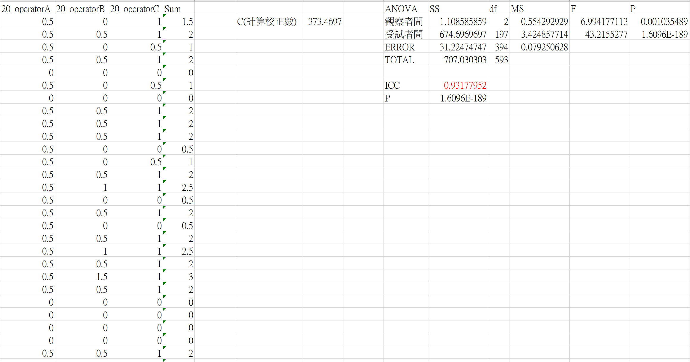

## Data Reliability

For our commercial kit, it will be operated by different user. To asure the consistency of results between different operators, we should execute reliability tests for many times.

Kappa value will usually be caculated for the reliablilty between 2 operators. However, Kappa value is always considered as highly strict reliability index. Furthemore, we conducted to a survey that compared more than 2 operators. For the account, we used ICC as our reliablity index. The formula was written in excel file. You can find it in "臨床測試_ICC_ANOVA_Reliability_刪減版.xlsx".

## Results Demo

The explanation of ICC value is attached below.

## ICC

ICC stands for the reliablity and the value represents:

| ICC | Reliability |
| ----------- | ----------- |
| 0-0.2 | Poor |
| 0.2-0.4 | Fair |
| 0.4-0.6 | Moderate |
| 0.6-0.8 | Good |
| 0.8-1 | Very good |