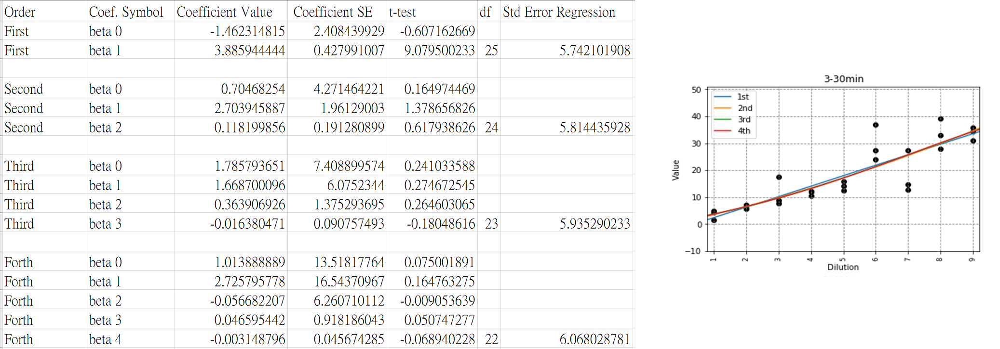

# Linearity of ELISA kit results

We must build the equation that can help user convert ELISA OD value to real concentration value of substract. We firstly need to know the accociation between OD value and concentration value, so that we observed EP06's regulations to fit out data with multi-order regression. 

In next step, we will find acceptable range of concentration for future ELISA kit product release.

## Demo of Regression

In this case, due to the beta_2 of 2-order regression(y = beta_2*x^2 + beta_1*x + beta_0) is not significant in t-test. We can expected the relationship between OD value and concentration value is complied with first-order regression. It implies the linear relationship.

## Demo of acceptable range of accociation between OD & concentration value

If the relationship is not linear, higher order regression will be applied. However, we need conduct further compiration between 1-order and higher-order to find a acceptable range in higher order regression.

The results imply if we use 2nd-order as our OD-concentration transformaiton equation, the acceptable concentration range is between 6.27 to 33.7. Furthemore, if 3rd-order is selected, there is an unacceptable value (11.5) that outrange our acceptable range.
