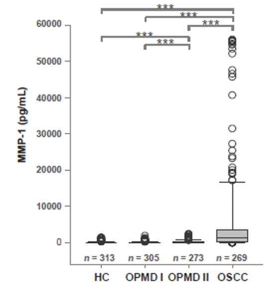
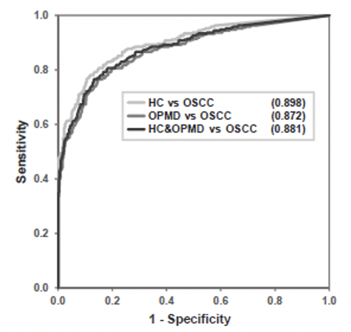
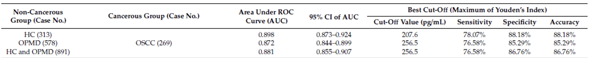

# Statistical Test & Cut-off Value of Product

As our data distribution is not normal distribution, we use non-parameter test for our statistical test. At First, Kruskal-Wallis test is adopted to examine whether there are significant differences between various groups. Secondly, Dunn's multiple comparison test is used to find which groups are significant differences under controlling alpha-error at 5%. Last, we utilize ROC curve to find out acceptable cut-off point of our product for users to determine a result.

## Find the power to distinguish disease group from population

1. results of non-parameter tests under 5% alpha error

In there results, we can convince that our ELISA kit can significantly distinguish people who have cancer (OSCC) or health. Furthemore, this kit can also cetainly find out people with pre-malignancy (OPMD-II) who always have a good pognosis if proper treatments are taken.

2. ROC curve

s

We can know that the AUC of "health control versus OSCC" are up to 0.89. It's means our tool fetures high capability to dinstinguish between cancer patient and health person.

## Find the cut-off value of our ELISA kits

We used DeLong test to confirm that AUC of our ELISA kit performs well on 95% confidence. Then, we gave the cut-off value of our product for others to use. 
