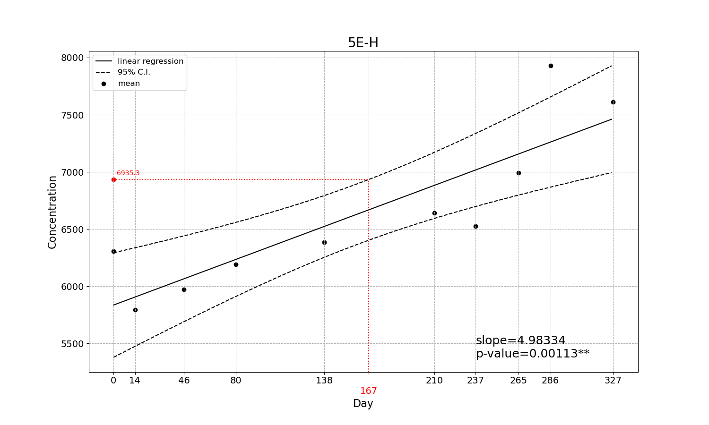

# Stability (Expiry Data)

For launching a new product, we need to know how long will the product can be stored that means expiry data. We stored our product properly and conducted experimental test every month for a year. Then, we need to know the change of results so that regression were used to estimate the trend of figure's change. Forthemore, 95% C.I. were also calculted that stood for confident range of the changes. After that, we can set a regulation to find out the expiry date of our product.

# Demo

Trend of demo's data and the estimated expiry date 

As a result of the ascent trend of data over times, in this demonstration, we set our acceptable value of product's result is up to 5% of the result on day 0. Of course, you can set any other acceptable value on your preference. In this case, the expiry date is 167 days concerning 95% confident interval.