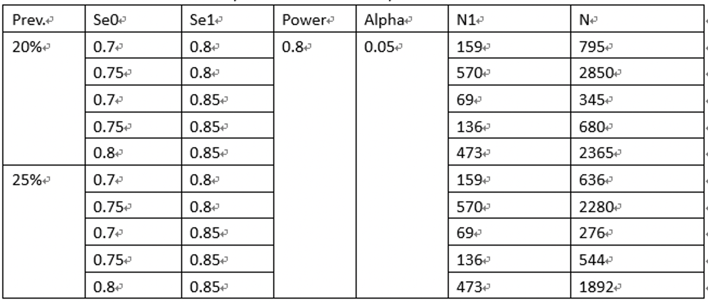

# Sample Size Estimation

For testing the roll of our ELISA kit for hospital patients, we need enroll extra specimens to do an investigation. Concerning the costs on expiriment, we estimated a sample size we need in advance. 

## Demo

We assume some different conditions about prevelence of disease, probability of disease in hospital, acceptable power and alpha-error. Finally found the estimation of sample size. In this case, we need at least 2850 samples conservatively.